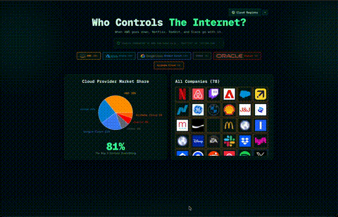

# Cloud Dashboard

An interactive cloud infrastructure visualization dashboard that reveals which companies depend on which cloud providers and explores AWS regions worldwide. When AWS goes down, Netflix, Reddit, and Slack go with it—this dashboard shows you exactly who controls the internet.

[](LICENSE)
[](https://nextjs.org/)
[](https://www.typescriptlang.org/)

## Demo Videos

### Cloud Dashboard in Action



## Why This Project

Cloud Dashboard was created to provide transparency into the hidden dependencies of our digital infrastructure. This need became critically clear after AWS experienced multiple outages last year, including a major 13-hour incident in December 2025 caused by an AI coding tool called Kiro, which autonomously decided to "delete and recreate" a production environment, triggering cascading failures across AWS services. When a single cloud provider goes down, hundreds of major services go with it—this dashboard visualizes those critical relationships and helps understand the true concentration of internet infrastructure.

## Standout Features

- **Interactive Visualizations**: Pie charts, treemaps, and 3D globe with smooth animations
- **Real-time Cloud Detection**: Automatically identify cloud providers from HTTP headers
- **Company Database**: Pre-loaded with 100+ major companies (S&P 500, tech giants)
- **Dynamic Company Addition**: Add any company URL and see instant market share updates
- **AWS Region Mapping**: Complete dataset of AWS regions, availability zones, and local zones
- **Responsive Design**: Works seamlessly on desktop, tablet, and mobile devices
- **Dark Theme**: Beautiful emerald-themed UI optimized for data visualization
- **Automatic Cloud Detection**: Uses HTTP headers and content analysis to identify cloud providers
- **Interactive 3D Globe**: D3.js-powered rotating Earth visualization of AWS datacenter locations
- **Real-time Company Addition**: Dynamically add companies and see market share updates instantly

## Tech Stack

- **[Next.js 15](https://nextjs.org/)** - React framework with App Router
- **[React 19](https://reactjs.org/)** - UI library
- **[TypeScript](https://www.typescriptlang.org/)** - Type safety
- **[Tailwind CSS 4](https://tailwindcss.com/)** - Utility-first styling
- **[D3.js](https://d3js.org/)** - 3D globe visualization and geographic projections
- **[Recharts](https://recharts.org/)** - Interactive charts and data visualization
- **[Radix UI](https://www.radix-ui.com/)** - Accessible component primitives
- **[Vercel Analytics](https://vercel.com/analytics)** - Web analytics

## Architecture (Essential)

```
CloudDashboard/
├── app/
│   ├── api/detect-cloud/    # Cloud provider detection API
│   ├── layout.tsx            # Root layout with metadata
│   └── page.tsx             # Main page router
├── components/
│   ├── aws-regions-explorer.tsx    # AWS regions visualization
│   ├── cloud-dependency-explorer.tsx  # Main dashboard
│   ├── rotating-earth.tsx          # 3D globe component
│   └── ui/                          # Reusable UI components
├── lib/
│   ├── company-data.ts      # Company dataset
│   └── utils.ts             # Utility functions
└── public/
    ├── aws-regions.json      # AWS region data
    └── *.json                # Additional region metadata
```

## Quick Run

### Option 1: Live Demo
Visit [your-vercel-app.vercel.app](https://your-vercel-app.vercel.app) to try the dashboard instantly.

### Option 2: Local Development

1. **Clone & install**
   ```bash
   git clone https://github.com/yourusername/CloudDashboard.git
   cd CloudDashboard
   npm install
   ```

2. **Run the app**
   ```bash
   npm run dev
   ```

3. **Open** [http://localhost:3000](http://localhost:3000)

No API keys or setup required - comes with 100+ pre-loaded companies.

## Usage

### Cloud Dependency Explorer

The main dashboard shows companies organized by cloud provider:

1. **Search Companies**: Type a company name or domain (e.g., "Netflix" or "stripe.com")
2. **Filter by Provider**: Click provider pills (AWS, Azure, GCP, etc.) to filter companies
3. **Add New Companies**: Enter a URL or domain and press Enter to auto-detect the cloud provider
4. **View Market Share**: Interactive pie chart shows provider distribution
5. **Hover Interactions**: Hover over chart segments to highlight companies

### AWS Regions Explorer

Explore AWS datacenter locations worldwide:

1. Click **"Cloud Regions"** button in the top-right
2. **Search Regions**: Use the search bar to find regions by name, code, or AWS region ID
3. **Select Regions**: Click a region to zoom on the globe, or Cmd/Ctrl+click for multi-select
4. **View Details**: Click the info icon to see detailed region information
5. **Resize Sidebar**: Drag the right edge to adjust sidebar width

### Cloud Provider Detection API

The app includes an API endpoint that automatically detects cloud providers:

```typescript
// POST /api/detect-cloud
const response = await fetch('/api/detect-cloud', {
  method: 'POST',
  headers: { 'Content-Type': 'application/json' },
  body: JSON.stringify({ url: 'https://example.com' })
})

const result = await response.json()
// { provider: 'AWS', confidence: 'high', signals: [...] }
```

## Roadmap

Planned features and improvements:

- [ ] **Multi-Cloud Support**: Add Azure, GCP, Oracle, and Alibaba region explorers
- [ ] **Historical Data**: Track cloud provider migrations over time
- [ ] **Outage Impact Analysis**: Show which companies are affected during cloud outages
- [ ] **Export Functionality**: Export company lists and visualizations as CSV/PNG
- [ ] **Company Details Panel**: Show more information about each company (industry, revenue, etc.)
- [ ] **Region Comparison**: Compare latency, pricing, and features across regions
- [ ] **API Rate Limiting**: Add rate limiting to cloud detection API
- [ ] **Caching**: Implement caching for cloud detection results
- [ ] **Bulk Import**: Import multiple companies from CSV or JSON
- [ ] **Real-time Updates**: WebSocket support for live market share updates

See the [open issues](https://github.com/yourusername/CloudDashboard/issues) for a full list of proposed features and known issues.
